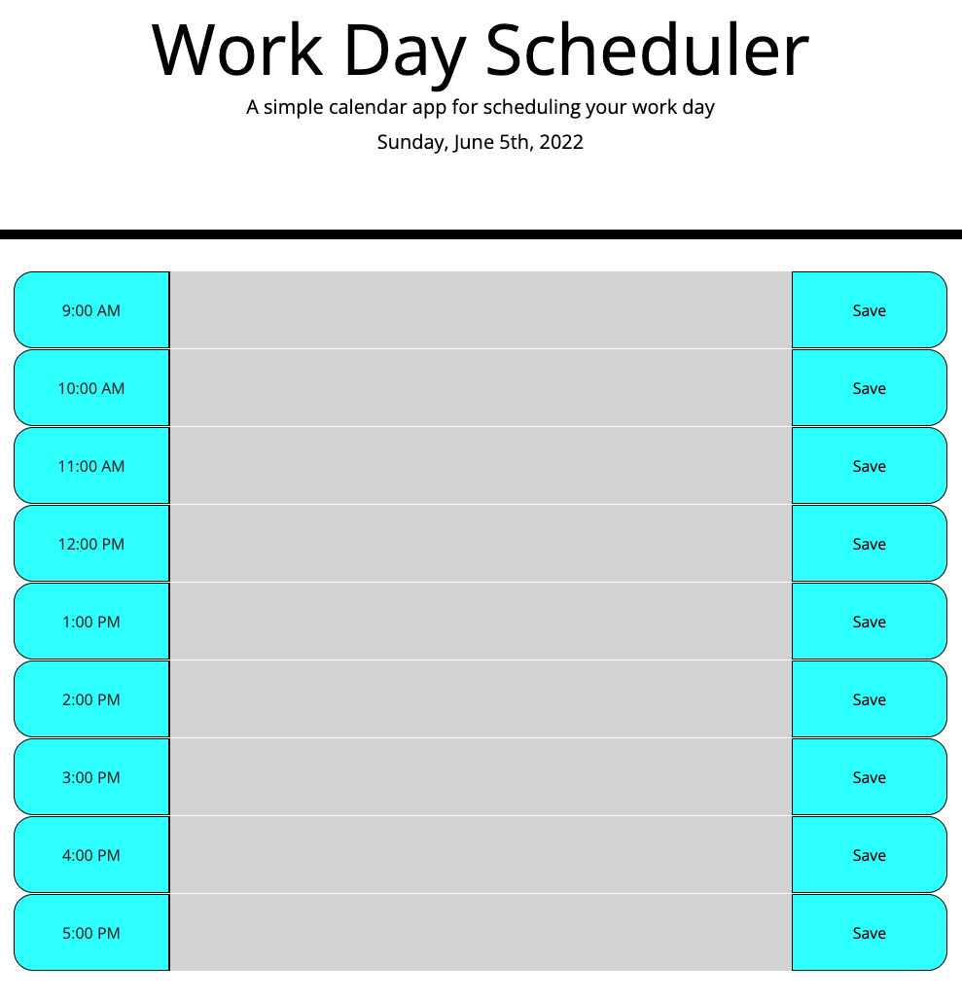

# Work Day Scheduler Starter Code

# Scheduler for normal business hours; changes colors based upon what events are in past, present and future.

# Saves entry data in local storage that persists.

